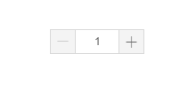

#rc-components

#InputNumber

```js
import {InputNumber} from 'rc-components';

const onChange = (value) => {
	console.log(value);
};

<InputNumber onChange={onChange} />
```
Demo:



#CheckButton

```js
import {CheckButton} from 'rc-components';

const onChange = (value, checked) => {
	console.log(`status of [${value}] is ${checked}`);
};

<CheckButton value="Blue Green" color="#87E1F1" onChange={onChange} />
```
Demo(Inactive):


Demo(Active):


#CheckButtonGroup(Usage One)

```js
import {CheckButtonGroup} from 'rc-components';

const onChange = (value, checked) => {
	console.log(`status of group is ${checked}, value is:[${value}]`);
};

const colorGroup = [
	{
		value: "Blue",
		color: "#8ACCFA",
	}, {
		value: "Blue Green",
		color: "#87E1F1",
	}, {
		value: "Champagne",
		color: "#E9D7B4",
	}
];

<CheckButtonGroup options={colorGroup} onChange={onChange} isTooltipVisible={true} />
```

#CheckButtonGroup(Usage Two)

```js
import {CheckButtonGroup} from 'rc-components';

const onChange = (value, checked) => {
	console.log(`status of group is ${checked}, value is:[${value}]`);
};

const images = [
	{
		value: "Dress Image1",
		img: "/images/checkButton.jpg",
	}, {
		value: "Dress Image2",
		img: "/images/checkButton.jpg",
	}, {
		value: "Dress Image3",
		img: "/images/checkButton.jpg",
	}
];

<CheckButtonGroup options={images} onChange={onChange} width={100} height={100}/>
```
